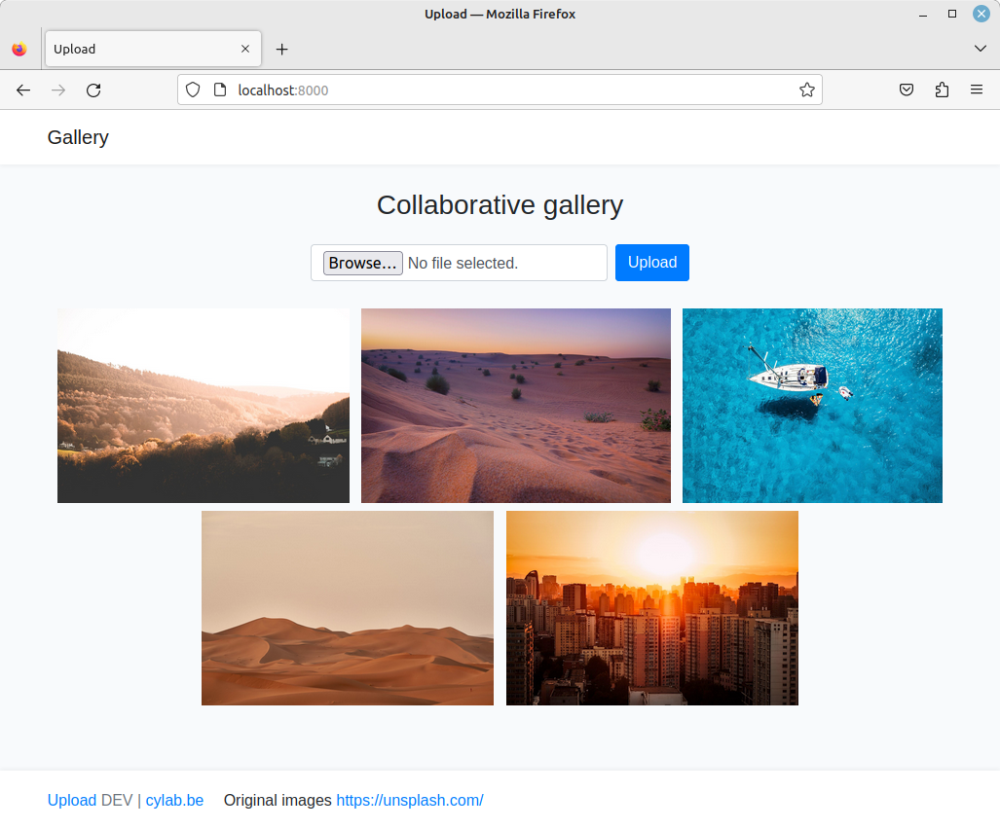

# Upload

[](https://gitlab.cylab.be/cylab/play/upload/-/commits/main)
[](https://gitlab.cylab.be/cylab/play/upload/-/releases)
[](https://labs.play-with-docker.com/?stack=https://gitlab.cylab.be/cylab/play/upload/-/raw/main/docker-compose.yml)



A vulnerable web application due to [unrestricted file upload](https://owasp.org/www-community/vulnerabilities/Unrestricted_File_Upload)

* the app is a picture gallery
* uploaded images are not filtered or validated

## Try in Play with Docker

[](https://labs.play-with-docker.com/?stack=https://gitlab.cylab.be/cylab/play/upload/-/raw/main/docker-compose.yml)

## Run with docker-compose

Easiest way to run the vulnerable app is using docker-compose:

```bash
mkdir upload
cd upload
curl -o docker-compose.yml https://gitlab.cylab.be/cylab/play/upload/-/raw/main/docker-compose.yml
docker-compose up
```

After a few seconds, the app will be available at ```http://127.0.0.1:8000```


## Run with Docker

```bash
docker run -p 8000:80 gitlab.cylab.be:8081/cylab/play/upload
```

## Testing locally

You can use PHP built-in webserver to test locally:

```bash
git clone https://gitlab.cylab.be/cylab/play/upload.git
cd upload/public
php -S localhost:8000
```

